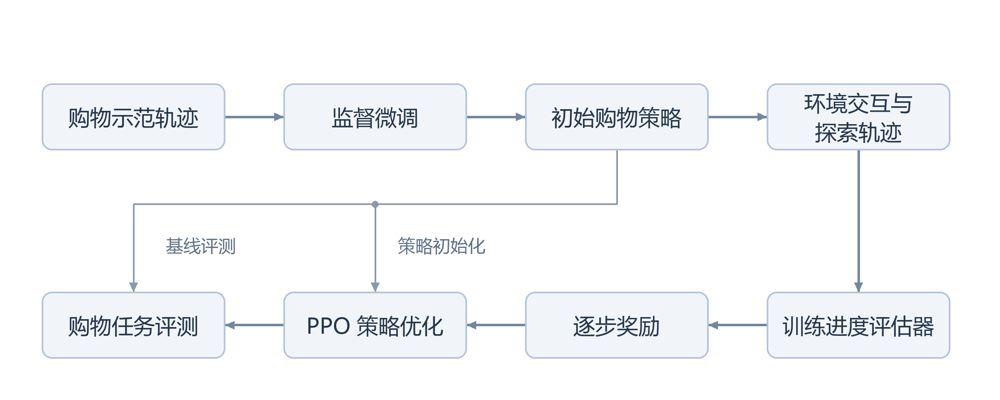
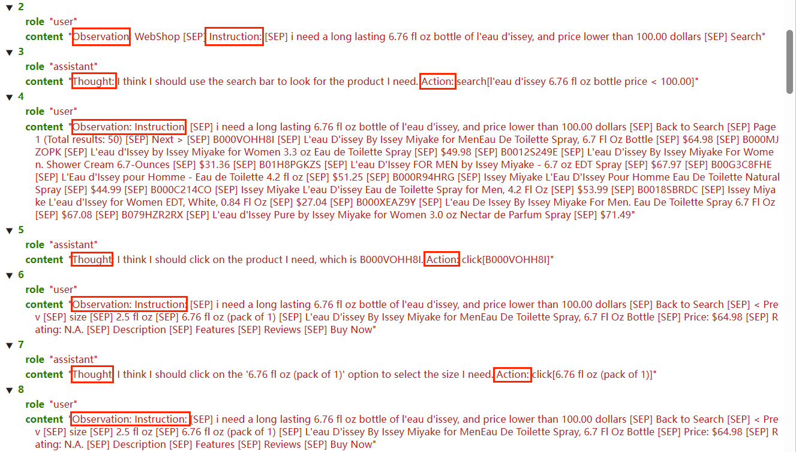

# 基于强化学习的网页购物助手设计

围绕 SPA-RL 逐步进度归因方法与 WebShop 网页购物环境开展的论文复现学习项目，关注多步任务中的奖励分配：让智能体在搜索、浏览、选择商品的过程中获得更细致的训练反馈。

本仓库整理 `网络购物助手.one` 中的复现过程，包括 Llama-3.2-3B-Instruct 的 LoRA 配置、轨迹收集、进度评估、PPO 启动与环境排错，并保留关键截图和原论文入口。

当前状态：复现过程与证据归档。OneNote 中保存了配置、代码讲解和运行截图，可核对部分执行过程；完整训练源码、模型权重及原始评测输出尚未纳入本仓库。任务完成率仍待核验。

## 研究来源

本项目学习和复现的对象是 [SPA-RL 原论文](https://arxiv.org/abs/2505.20732v1)，原作者为 Hanlin Wang、Chak Tou Leong、Jiashuo Wang、Jian Wang 和 Wenjie Li。方法及官方实现归原作者所有，代码入口见 [SPA-RL 官方仓库](https://github.com/WangHanLinHenry/SPA-RL-Agent)。

交互任务采用 [WebShop](https://github.com/princeton-nlp/WebShop) 的模拟购物场景：智能体根据商品需求执行搜索与点击，最终选择商品。本项目材料围绕该模拟环境展开；真实购物网站部署、手机应用操作和真实支付尚无实现材料。

## 项目思路

复现笔记围绕以下流程组织。图示描述研究流程，各阶段现有证据见下表。

笔记涉及四项工作：购物轨迹的对话格式整理、基于 LoRA 的监督微调、进度评估器与 PPO 训练的衔接，以及通过 FastChat / vLLM 服务进行环境评测。具体配置、样例和执行记录见[复现笔记](docs/NOTES.md)。

## 复现过程展示

下图为 OneNote 保存的 WebShop 交互样例，包含商品指令、搜索、浏览与选项选择。它用于展示轨迹结构，不是整体验证成绩。

## 已有记录与结果状态

| 内容 | 现有材料 | 当前结论 |
| --- | --- | --- |
| 模型与微调 | 配置截图指定 Llama-3.2-3B-Instruct、LoRA 秩 8、缩放系数 16 | 有配置与权重合并检查记录 |
| 轨迹收集 | 终端截图显示进度达到 1,624 / 1,624 | 可确认一次收集循环完成，不能据此判断任务成功率 |
| 轨迹与逐步评分 | 截图展示 4,791 条记录的容器，以及贡献值、预测值与终局奖励 | 有样例，缺少可重新统计的原始文件 |
| PPO | 启动截图显示加载 1,596 条样本及可训练参数信息 | 可确认启动记录，未见完整训练结束与评测汇总 |
| 任务完成率 | 笔记记录监督微调 78%、PPO 84%，另一处为 86% | 无评测日志，最终结果待核验 |
| 指标定义 | 笔记采用匹配奖励超过 0.5 的阈值 | 与 WebShop 原论文的成功率定义不同 |

84% 相比 78% 是提高 6 个百分点；86% 则对应 8 个百分点。原始记录尚不足以确定最终采用哪组结果。数值来源、评测口径与待补证据见[实验记录与核验](docs/EXPERIMENTS.md)。

## 阅读导航

| 文档 | 内容 |
| --- | --- |
| [复现笔记](docs/NOTES.md) | OneNote 页面索引、关键配置、运行截图与排错记录 |
| [设计与方法](docs/METHOD.md) | 问题背景、训练链路、原论文与项目笔记的对应关系 |
| [实验记录与核验](docs/EXPERIMENTS.md) | 已有数值、冲突记录、成功率定义及证据缺口 |
| [复现路线与代码入口](docs/REPRODUCTION.md) | 官方实现各阶段入口、继续复现所需材料 |
| [参考资料与归属](docs/REFERENCES.md) | 原论文、环境、相关工作及材料整理边界 |

## 如何使用

本仓库可直接阅读，无需安装运行环境。若要开展训练，请从[复现路线](docs/REPRODUCTION.md)进入官方实现，依据自己的硬件与数据准备环境。笔记截图是历史记录，本文档整理过程未重新执行模型训练或评测。

## 致谢与归属

感谢 SPA-RL、WebShop 及相关开源工作的作者。本仓库是个人复现学习材料的中文整理，不是原论文官方实现；原论文的实验结果与本项目笔记分别标注。第三方论文和代码请通过[参考资料](docs/REFERENCES.md)访问，并遵循各自的许可与引用要求。
