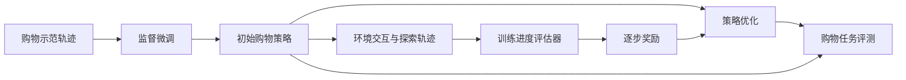

# 基于强化学习的网页购物助手设计

围绕 **SPA-RL 逐步进度归因方法**与 **WebShop 网页购物环境**开展的论文复现学习项目，关注多步任务中的奖励分配：让智能体在搜索、浏览、选择商品的过程中获得更细致的训练反馈。

本仓库整理项目设计、方法理解与已有实验笔记，便于展示学习过程，并为后续补齐代码和实验记录提供索引。

> **当前发布状态：文档型复现档案。** 已有材料为论文和设计笔记，当前仓库不包含复现代码、模型权重、训练日志或逐任务评测记录。笔记中的数值尚未核验，不作为已验证的复现结论。

## 研究来源

本项目学习和复现的对象是 [SPA-RL 原论文](https://arxiv.org/abs/2505.20732v1)，原作者为 Hanlin Wang、Chak Tou Leong、Jiashuo Wang、Jian Wang 和 Wenjie Li。方法及官方实现归原作者所有，代码入口见 [SPA-RL 官方仓库](https://github.com/WangHanLinHenry/SPA-RL-Agent)。

交互任务采用 [WebShop](https://github.com/princeton-nlp/WebShop) 的模拟购物场景：智能体根据商品需求执行搜索与点击，最终选择商品。本项目材料围绕该模拟环境展开；真实购物网站部署、手机应用操作和真实支付尚无实现材料。

## 项目思路

设计笔记围绕以下流程组织。图示描述方法流程，不代表当前仓库已提供可运行实现。

笔记涉及四项工作：购物轨迹的对话格式整理、基于 LoRA 的监督微调、进度评估器与 PPO 训练的衔接，以及通过 FastChat / vLLM 服务进行环境评测。其实现情况仍需对应代码和日志支撑，方法说明见[设计与方法](docs/METHOD.md)。

## 已有记录与结果状态

| 内容 | 现有材料 | 当前结论 |
| --- | --- | --- |
| 任务与方法设计 | 多版本设计笔记 | 可供阅读与讨论 |
| 数据规模 | 笔记记录约 1,600 条轨迹 | 未附数据清单，划分记录存在差异 |
| 任务完成率 | 笔记记录监督微调 78%、PPO 84%，另一处为 86% | 无评测日志，最终结果待核验 |
| 指标定义 | 笔记采用匹配奖励超过 0.5 的阈值 | 与 WebShop 原论文的成功率定义不同 |
| 代码与模型 | 本次归档材料未提供 | 当前无法从本仓库运行实验 |

84% 相比 78% 是提高 **6 个百分点**；86% 则对应 **8 个百分点**。原始记录尚不足以确定最终采用哪组结果。数值来源、评测口径与待补证据见[实验记录与核验](docs/EXPERIMENTS.md)。

## 阅读导航

| 文档 | 内容 |
| --- | --- |
| [设计与方法](docs/METHOD.md) | 问题背景、训练链路、原论文与项目笔记的对应关系 |
| [实验记录与核验](docs/EXPERIMENTS.md) | 已有数值、冲突记录、成功率定义及证据缺口 |
| [复现路线与代码入口](docs/REPRODUCTION.md) | 官方实现各阶段入口、继续复现所需材料 |
| [参考资料与归属](docs/REFERENCES.md) | 原论文、环境、相关工作及材料整理边界 |

## 如何使用

本仓库可直接阅读，无需安装运行环境。若要开展训练，请从[复现路线](docs/REPRODUCTION.md)进入官方实现，依据自己的硬件与数据准备环境。本文档整理过程未执行模型训练或评测。

## 致谢与归属

感谢 SPA-RL、WebShop 及相关开源工作的作者。本仓库是个人复现学习材料的中文整理，不是原论文官方实现；原论文的实验结果与本项目笔记分别标注。第三方论文和代码请通过[参考资料](docs/REFERENCES.md)访问，并遵循各自的许可与引用要求。
