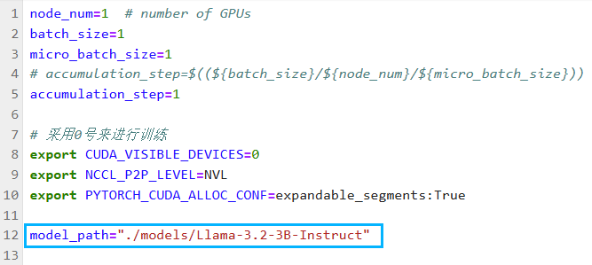
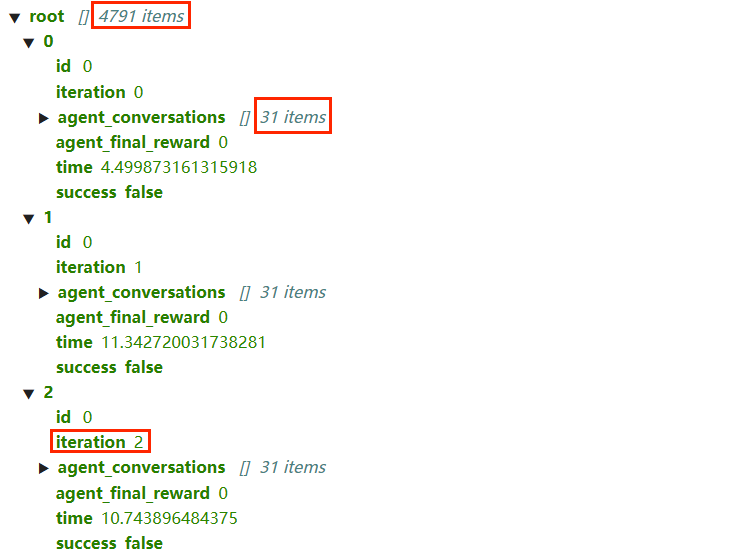
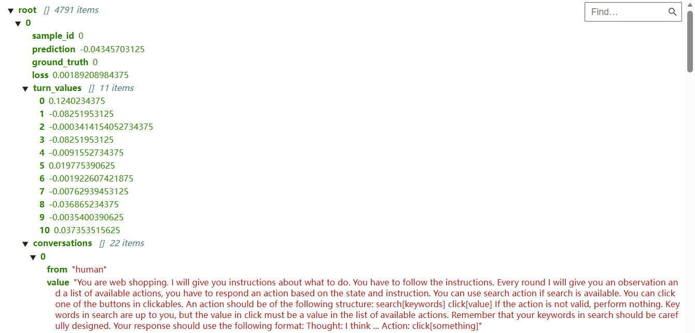
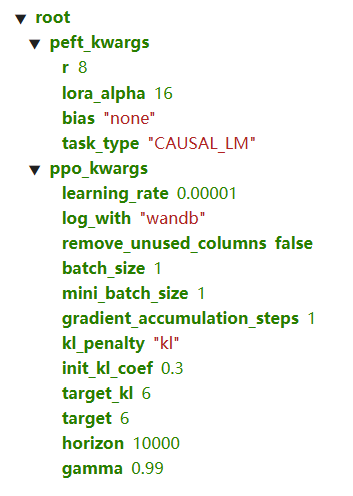

# 复现笔记

本文根据 `网络购物助手.one` 整理。原文件包含 8 个页面，保留了配置截图、终端输出、数据预览和辅助讲解。以下区分**截图可见事实**、**笔记中的配置**与**尚待验证的结论**，不把参考教程或辅助讲解当作实验结果。

## 页面索引

| 原笔记页面 | 页面内标注日期 | 内容 |
| --- | --- | --- |
| `Agent + lora + PPO + Prompt Engineering + deepspeed + vllm` | 2026-01-18 | 环境安装、排错、轨迹收集与训练启动截图 |
| 同名 `2.0` 页面 | 2026-01-25 | 模型配置、数据格式与方法理解 |
| `SFT 训练` | 2026-01-26 | 监督微调参数、数据与模型配置 |
| `轨迹数据收集` | 2026-01-26 | 控制器、推理服务及环境交互命令 |
| `进度估算器训练 + 推理` | 2026-01-27 | LoRA、进度预测、训练参数与输出解释 |
| `PPO` | 2026-01-27 | 训练入口、输入格式与逐步奖励代码阅读 |
| `评估` | 2026-01-27 | 控制器、模型服务、评测程序的启动方式 |
| `基于强化学习的网页购物助手设计文档` | 设计材料 | 项目概述与问答整理 |

日期取自页面文字，不能据此认定该页全部内容在当天完成。

## 模型与配置

模型路径截图指定 `Llama-3.2-3B-Instruct`。单卡微调、LoRA 和推理服务的参数记录如下；这些是笔记中的配置，不是重新运行后导出的配置快照。

| 阶段 | 参数记录 | 注意事项 |
| --- | --- | --- |
| 监督微调 | 1 轮、单设备批量 1、梯度累积 1、最大长度 2,048 | 截图中的学习率为 `2e-4`，文字说明为 `2e-5`，最终取值未确定 |
| LoRA | 秩 8、缩放系数 16、丢弃率 0.05 | 监督微调与进度评估的配置需分别核对 |
| 进度评估 | 最大长度 1,024、10 轮、学习率 `3e-6`、单设备批量 1、BF16 | 笔记代码片段的输出目录含 `virtualhome`，不能据此判断实际评测环境 |
| 轨迹推理服务 | 显存利用率 0.8、最大长度 8,192 | 服务配置与模型标称最大上下文不同 |
| 探索 | 每个任务尝试 3 次、单个数据分片 | 原始任务清单与失败处理未提供 |
| PPO | 学习率 `1e-5`、批量 1、初始 KL 系数 0.3、目标 KL 6、折扣因子 0.99 | 来自配置截图，不能推断最终训练完成 |

原笔记中的算力页面显示 A100 40 GB、Ubuntu 22.04、PyTorch 2.5.1、CUDA 12.4 和 Python 3.12；另有终端路径显示独立的 Python 3.9 环境。因此这里只记录平台截图信息，不将它视为所有阶段统一的依赖清单。

## 轨迹收集：有循环完成记录

终端截图显示环境加载了 12,087 个目标，随后收集循环的 `n_tasks` 为 1,624，最终进度达到 `1624/1624`，显示耗时约 8 小时 8 分钟。这里的完成指采集循环结束，不是购物任务成功。

数据预览截图显示一个包含 4,791 条记录的容器，每条记录包含任务编号、尝试序号、交互内容、终局奖励与成功标志。已展开的样例中也包含奖励为 0、成功标志为假的轨迹。1,624 次任务 × 3 次尝试与 4,791 条记录之间的差异，需要原始文件和过滤规则解释。

交互中出现的 `Thought`、`Action` 和 `Observation` 是被研究智能体的轨迹内容，属于实验数据。

## 进度估算：有输出样例

笔记保存了包含 `prediction`、`ground_truth`、`loss` 与 `turn_values` 的数据预览。它表明材料中已有逐步贡献与轨迹预测的输出样例，但单条样例不足以评价估算器质量，也不能据此推断购物成功率。

## PPO：有启动记录，缺少结束记录

启动截图显示运行 `ppo/train_ppo.sh`，数据准备阶段加载 1,596 条样本，模型检查点加载完成，并输出 2,296,833 个可训练参数。当前可见内容停留在启动阶段，未显示全部训练轮次结束、最终模型校验或测试集汇总。

`PPO` 页面还包含带省略号的训练器代码讲解，涉及分段掩码、逐步奖励及优势估计。它可用于阅读方法，不能作为完整、可执行的源码文件。

## 环境排错记录

| 笔记中的问题 | 当时记录的处理或排查方向 | 证据边界 |
| --- | --- | --- |
| `flash_attn` 构建失败 | 记录了关闭构建隔离的安装命令 | 未提供完整依赖锁定文件 |
| 训练参数解析不识别 `evaluation_strategy` | 截图将其改为 `eval_strategy` | 与安装版本有关，不能直接套用到其他版本 |
| 自定义进度模型不支持 SDPA | 截图显式使用 `attn_implementation="eager"` | 保存了配置调整，完整训练结束状态待核对 |
| 商品文件路径问题 | 在加载函数中打印实际文件路径 | 后续有环境加载与收集循环截图 |
| PPO 依赖缺失 | 记录缺少 `rich` 的导入错误 | 后续有 PPO 启动截图，缺少最终环境清单 |

本次整理只记录历史过程，没有按笔记中的命令修改算法或重新训练。

## 仍需补齐

完整源码、依赖清单、模型检查点和原始评测输出尚未与这些截图建立可复查的对应关系。尤其是设计文档中的 78%、84%／86%，不能由上述过程截图推导。具体冲突见[实验记录与核验](EXPERIMENTS.md)。
